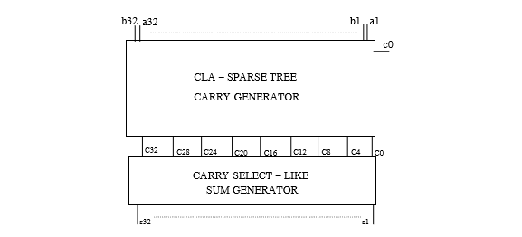
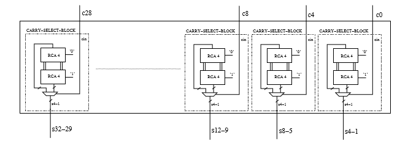
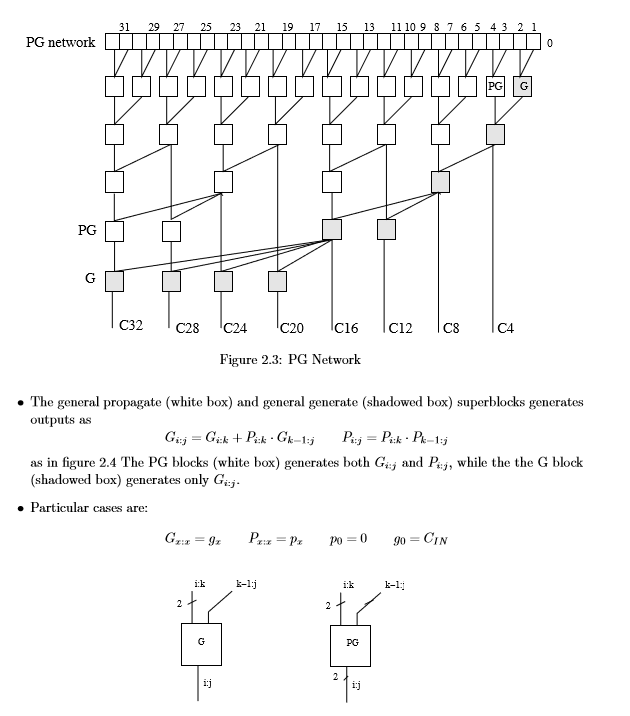

The fast adder has been implemented using two main part, a carry select like adder and the sparse tree generator. The top level entity for the adder is the Pentium_IV_adder.vhdl. This adder is the one implemented in the pentium 4, the very last top level is the Adder_subctractor.vhdl that uses the PIV adder to perform addition and subctraction. The subctraction has been implemented doing the two's complement of the second input (B). The add/sub support addition and subctration for both signed and unsigned numbers (is up to the control handle the situations) for generic N bits input length.

Fast adder general structure:

Carry select sum generator structure: 

Sparse tree generator structure:

